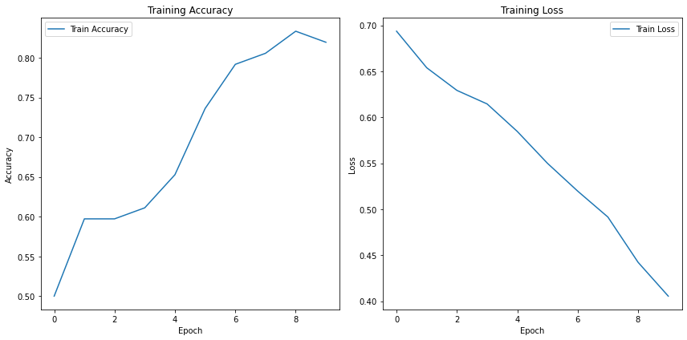
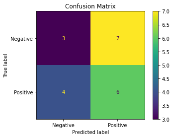
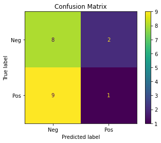
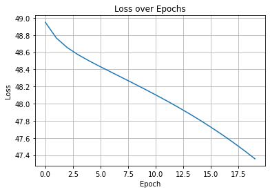

# Duygu Analizi için Tekrarlayan Sinir Ağları (RNN) ile Sınıflandırma

## Giriş 

Bu proje, tekrarlayan sinir ağlarını (RNN'ler) kullanarak duygu analizi ve metin sınıflandırması gerçekleştirmektedir. Proje, iki farklı RNN modeli uygulamaktadır: sıfırdan oluşturulan bir RNN ve TensorFlow/Keras kütüphanesi kullanılarak oluşturulan bir RNN. Amaç, bu iki modelin performansını karşılaştırmak ve RNN'lerin duygu analizi görevlerindeki etkinliğini değerlendirmektir.

## Yöntem 

### 1. Veri Seti

Projede, cümleler ve bunlara karşılık gelen duygu etiketlerinden oluşan bir veri seti kullanılmıştır (`data.py`). Veri seti, olumlu ve olumsuz duyguları temsil eden cümleleri içermektedir. Veri seti, veri zenginleştirme teknikleri kullanılarak genişletilmiştir. Eşanlamlı kelimeler kullanılarak veri augmentation yapılmıştır. (`data.py` dosyasındaki `augment_sentence` fonksiyonu)

### 2. Veri Ön İşleme

Veri ön işleme adımları şunları içermektedir (`data_loader.py`):

* **Kelime Dağarcığı Oluşturma:** Veri setindeki tüm kelimelerden bir kelime dağarcığı oluşturulmuştur.
* **Vektörleştirme:** Cümleler, kelime dağarcığındaki indekslere dönüştürülerek sayısal vektörlere çevrilmiştir.
* **Padding:** Keras modeli için cümleler aynı uzunluğa getirilmiştir.

### 3. Model 1: Sıfırdan RNN Uygulaması

* Sıfırdan bir RNN sınıfı (`rnn.py`) oluşturulmuştur. Bu sınıf, ileri yayılım, kayıp hesaplama, geri yayılım ve tahmin fonksiyonlarını içermektedir.
* Model, girdi katmanı, gizli katman ve çıktı katmanından oluşmaktadır.
* Modelde `tanh` aktivasyon fonksiyonu ve `softmax` çıkış fonksiyonu kullanılmıştır.
* Eğitim sırasında kayıp fonksiyonu olarak çapraz entropi (cross-entropy) kaybı kullanılmıştır.
* Model, `train.py` dosyası kullanılarak eğitilmiştir. Eğitim sırasında optimizasyon algoritması olarak gradyan inişi (gradient descent) kullanılmıştır.

### 4. Model 2: Keras ile RNN Uygulaması

* TensorFlow/Keras kütüphanesi kullanılarak bir RNN modeli oluşturulmuştur (`keras_model.py`).
* Model, bir gömme (embedding) katmanı, bir SimpleRNN katmanı ve bir yoğun (dense) çıktı katmanından oluşmaktadır.
* Modelde `tanh` aktivasyon fonksiyonu ve `softmax` çıkış fonksiyonu kullanılmıştır.
* Model, `adam` optimizasyon algoritması ve `categorical_crossentropy` kayıp fonksiyonu kullanılarak eğitilmiştir.

### 5. Değerlendirme Metrikleri

Modellerin performansını değerlendirmek için aşağıdaki metrikler kullanılmıştır:

* Doğruluk (Accuracy)
* Kesinlik (Precision)
* Duyarlılık (Recall)
* F1 Skoru
* Karmaşıklık Matrisi (Confusion Matrix)
* Sınıflandırma Raporu (Classification Report)
* Kayıp Grafiği (Loss Curve)

### Model 1: Sıfırdan Yazılmış RNN

- **Girdi boyutu:** Kelime indeksleme yöntemi ile oluşturulan kelime sayısı
- **Gizli katman:** 16 nöron
- **Çıkış:** 2 sınıf (negatif, pozitif)
- **Eğitim:** 20 epoch, çapraz entropi kaybı
- **Geri yayılım:** Manuel türevlerle backward fonksiyonu

### Model 2: Keras Tabanlı RNN

- `Embedding` katmanı
- `SimpleRNN` katmanı (16 birim)
- `Dense` çıkış katmanı (sigmoid aktivasyon)
- **Eğitim:** 10 epoch, `adam` optimizer, `binary_crossentropy` kaybı

## Sonuçlar (Results)

### Keras RNN Modeli Sonuçları:

**Sınıflandırma Raporu:**

 |          | precision | recall | f1-score | support |
|----------|-----------|--------|----------|---------|
| Negative | 0.82      | 0.90   | 0.86     | 10      |
| Positive | 0.89      | 0.80   | 0.84     | 10      |
| accuracy |           |        | 0.85     | 20      |
| macro avg| 0.85      | 0.85   | 0.85     | 20      |
|weighted avg| 0.85      | 0.85   | 0.85     | 20      |

**Eğitim Kaybı ve Doğruluğu Grafiği:**

**Karmaşıklık Matrisi:**

### Sıfırdan Yazılan RNN Modeli
**Sınıflandırma Raporu:**
|          | precision | recall | f1-score | support |
|----------|-----------|--------|----------|---------|
| Negative | 0.43      | 0.30   | 0.35     | 10      |
| Positive | 0.46      | 0.60   | 0.52     | 10      |
| accuracy |           |        | 0.45     | 20      |
| macro avg| 0.45      | 0.45   | 0.44     | 20      |
|weighted avg| 0.45      | 0.45   | 0.44     | 20      |

**Karmaşıklık Matrisi:**

**Loss Grafiği:**

## Tartışma

Elde edilen sonuçlar, Keras kütüphanesi kullanılarak oluşturulan RNN modelinin, sıfırdan implemente edilen modele göre önemli ölçüde daha iyi performans gösterdiğini açıkça ortaya koymaktadır. Keras modeli %85 test doğruluğuna ulaşırken, sıfırdan oluşturulan model yalnızca %45 doğruluk elde etmiştir.
Keras modelinde kullanılan `embedding` ve `SimpleRNN` katmanları daha gelişmiş optimizasyon algoritmaları ve ağırlık başlangıçları ile desteklenmektedir.
Karmaşıklık matrisleri incelendiğinde, Keras modelinin hem negatif hem de pozitif sınıfları daha doğru bir şekilde tahmin ettiği görülmektedir. Sınıflandırma raporu da Keras modelinin daha yüksek kesinlik (precision), duyarlılık (recall) ve F1 skorlarına sahip olduğunu desteklemektedir.

Sıfırdan oluşturulan modelin eğitim kaybı azalmasına rağmen, bu durum yüksek bir test doğruluğuna yansımamıştır. Bu, modelin aşırı öğrenme (overfitting) veya yetersiz öğrenme (underfitting) sorunları yaşadığını gösterebilir.Geri yayılım ve türev hesaplamalarında yaklaşık hatalar olabilir.
Keras modelinin daha iyi performans göstermesinin nedenleri arasında, Keras'ın optimize edilmiş katman implementasyonları, daha gelişmiş optimizasyon algoritmaları (Adam gibi) ve potansiyel olarak daha iyi varsayılan hiperparametreler yer alabilir.

Sonuç olarak, bu deneyde duygu analizi görevi için Keras kütüphanesi kullanılarak oluşturulan RNN modelinin, sıfırdan oluşturulan modele göre daha etkili olduğu görülmüştür. Ancak, sıfırdan model implementasyonu, RNN'lerin temel çalışma prensiplerini anlamak açısından değerli bir öğrenme deneyimi sunmaktadır.

## Referanslar

- Örnek proje: [https://github.com/vzhou842/rnn-from-scratch](https://github.com/vzhou842/rnn-from-scratch)
- Keras dokümantasyonu: [https://keras.io](https://keras.io)
- Scikit-learn metrikleri: [https://scikit-learn.org/stable/modules/model_evaluation.html](https://scikit-learn.org/stable/modules/model_evaluation.html)
